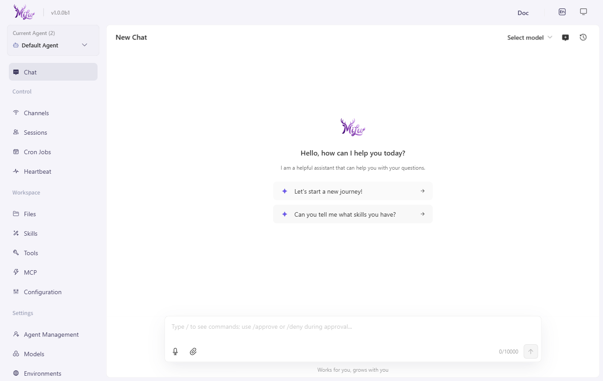

<p align="center">
  
</p>

<h1 align="center">MiLuAssistantDesktop</h1>

<p align="center">A Windows desktop installer edition based on MiLuAssistantWeb, packaging the local AI assistant experience with Electron and Inno Setup.</p>

<p align="center">
  <a href="./README.md">简体中文</a> | <a href="./README.en.md">English</a>
</p>

<p align="center">
  
  
  
  <a href="./LICENSE"></a>
</p>

<p align="center">
  
</p>

MiLuAssistantDesktop packages the MiLuAssistantWeb Python backend and web console into a native Windows application. It focuses on installability, local process orchestration, tray behavior, user data isolation, and a delivery experience suitable for demos or packaged distribution.

## Relationship

- **Web base**: [MiLuAssistantWeb](https://github.com/White-147/MiLuAssistantWeb)
- **Current repository**: Electron shell, installer, backend process management, tray integration, and Windows user-data isolation.
- **Purpose**: turn a developer-oriented web/backend project into a double-clickable Windows application.

## Runtime Flow

1. Electron starts and shows `src/loading.html` immediately (fast-launch UX).
2. The app finds a local free port and starts `python-env/python.exe -m milu app --host 127.0.0.1 --port <port>` in the background.
3. On first launch, milu auto-initializes the workspace/config; skill-pool setup runs in the background after the UI loads without blocking startup.
4. `BrowserWindow` loads the local Web UI after the backend is ready.
5. Closing the window minimizes to tray, and quitting the app terminates the backend process.
6. User data is isolated under `%LOCALAPPDATA%\MiLuAssistantDesktop`.
7. Startup acceleration: channels are loaded on demand via `MILU_DISABLED_CHANNELS` (only the console channel is enabled by default), avoiding heavy SDKs such as feishu lark_oapi (~20s) — the backend is ready in ~4 seconds.

## Installer Features (Inno Setup)

- Cancellable installation (not supported by NSIS).
- Optional checkboxes: desktop shortcut, start-menu shortcut, and auto-start on login (registry cleaned up on uninstall).
- Custom installation directory and branded wizard (white background with the web logo icon).
- Running app instances are closed automatically before install/uninstall to avoid file locks.

## Tech Stack

- **Desktop**: Electron, electron-builder (win-unpacked), Inno Setup 6.
- **Backend runtime**: Windows embeddable Python, MiLu Python package.
- **Build scripts**: PowerShell, Node.js.
- **Web UI source**: MiLuAssistantWeb backend and console.

## Local Development

Install MiLuAssistantWeb into the active Python environment first:

```powershell
cd D:\code\MiLuAssistantWeb
pip install -e .
```

Then start the desktop shell:

```powershell
cd D:\code\MiLuAssistantDesktop
npm install
powershell -ExecutionPolicy Bypass -File scripts\dev-start.ps1
npm start
```

## Build Installer

```powershell
cd D:\code\MiLuAssistantDesktop
npm install
powershell -ExecutionPolicy Bypass -File scripts\build-python-env.ps1     # build the embedded Python runtime
python scripts\build-docs.py <docs source md> docs-dist                 # generate local docs (or reuse docs-dist/)

# 1. Generate the app directory (win-unpacked, includes python-env and console)
npx electron-builder --win --dir

# 2. Compile the installer with Inno Setup 6 (install Inno Setup first; use full ISCC path if not on PATH)
"D:\soft\program\Inno Setup 6\ISCC.exe" installer.iss
```

The installer is emitted under the repository `release/` directory with a name such as `MiLuAssistantDesktop-Setup-<version>.exe`.

## License and Security

This repository uses the Apache License 2.0. See [LICENSE](LICENSE).

Security reporting instructions are in [SECURITY.md](SECURITY.md), and contribution notes are in [CONTRIBUTING.md](CONTRIBUTING.md).
