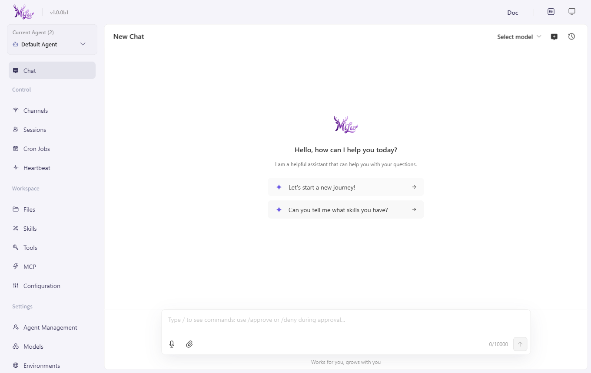

<p align="center">
  
</p>

<h1 align="center">MiLuAssistantDesktop</h1>

<p align="center">基于 MiLuAssistantWeb 改造的 Windows 桌面安装包版本，使用 Electron 与 NSIS 封装本地 AI 助手运行体验。</p>

<p align="center">
  <a href="./README.md">简体中文</a> | <a href="./README.en.md">English</a>
</p>

<p align="center">
  
  
  
  <a href="./LICENSE"></a>
</p>

<p align="center">
  
</p>

MiLuAssistantDesktop 是基于 MiLuAssistantWeb 改造的 Windows 桌面安装包版本。项目使用 Electron + electron-builder + NSIS 将 MiLu 的 Python 后端和 Web 控制台封装为原生 Windows 应用，提供更适合交付、演示和售卖的安装体验。

## 项目关系

- **Web 基座**：[MiLuAssistantWeb](https://github.com/White-147/MiLuAssistantWeb)
- **当前项目**：MiLuAssistantDesktop，负责桌面外壳、安装包、后端进程托管、托盘和用户数据隔离。
- **改造目的**：将原本需要开发环境启动的前后端项目，封装为普通用户可以安装和双击运行的 Windows 应用。

## 运行流程

1. Electron 启动后先显示 `src/loading.html`。
2. 首次启动时执行 `python-env/python.exe -m milu init --defaults --accept-security` 初始化工作区。
3. 自动寻找本机空闲端口，并启动 `python-env/python.exe -m milu app --host 127.0.0.1 --port <port>`。
4. 后端就绪后，`BrowserWindow` 加载本地 Web UI。
5. 关闭窗口时最小化到系统托盘，退出应用时自动结束后端进程。
6. 用户数据隔离在 `%LOCALAPPDATA%\MiLuAssistantDesktop` 下。

## 技术栈

- **桌面端**：Electron、electron-builder、NSIS。
- **后端运行时**：Windows embeddable Python、MiLu Python package。
- **构建脚本**：PowerShell、Node.js、C# launcher / uninstaller。
- **Web UI 来源**：MiLuAssistantWeb 的 Python 后端与前端控制台。

## 本地开发

先确保 MiLuAssistantWeb 已安装到当前 Python 环境：

```powershell
cd D:\code\MiLuAssistantWeb
pip install -e .
```

然后启动桌面壳：

```powershell
cd D:\code\MiLuAssistantDesktop
npm install
powershell -ExecutionPolicy Bypass -File scripts\dev-start.ps1
npm start
```

## 构建安装包

```powershell
cd D:\code\MiLuAssistantDesktop
npm install
powershell -ExecutionPolicy Bypass -File scripts\build-python-env.ps1
npm run dist
```

安装包会输出到 `D:\code` 目录，文件名形如 `MiLuAssistantDesktop-Setup-<version>.exe`。

## 系统要求

- **开发**：Windows 10/11、Node.js 18+、Python 3.10+。
- **构建**：需要可访问 Python 官方 embeddable package 下载地址。
- **运行**：Windows 10/11 x64。

## 说明

本项目是 MiLuAssistantWeb 的安装包化延伸，不是新的后端业务系统。后续如果要开发新的 AI 漫剧生产项目，应使用独立仓库 `MiLuStudio`，避免与当前旧版 MiLu 助手项目混淆。
